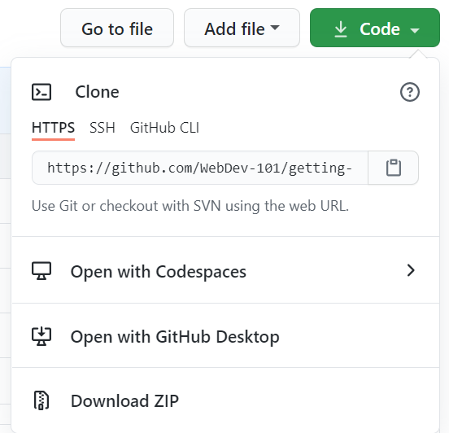

# Введение в GitHub

В этом уроке рассматриваются основы GitHub - платформы для хранения и управления изменениями вашего кода.


> Скетчноут [Tomomi Imura](https://twitter.com/girlie_mac)

## Предлекционный квиз

[Предлекционный квиз](https://happy-mud-02d95f10f.azurestaticapps.net/quiz/3)

## Введение

В этом уроке мы рассмотрим:

- отслеживание работы, которую вы делаете на своем устройстве
- совместная работа над проектами с другими людьми
- как внести свой вклад в программное обеспечение с открытым исходным кодом

### Требования

Прежде чем начать, вам нужно проверить, установлен ли Git. В терминале напечатайте:
`git --version`

Если Git не установлен, [установите Git](https://git-scm.com/downloads). Затем настройте свой локальный профиль Git в терминале:

- `git config --global user.name "ваше-имя"`
- `git config --global user.email "ваш-email"`

Чтобы проверить, настроен ли уже Git, вы можете ввести:
`git config --list`

Вам также понадобится аккаунт на GitHub, редактор кода (например, Visual Studio Code) и вам нужно будет открыть свой терминал (или командную строку).

Перейдите на [github.com](https://github.com/) и создайте аккаунт, если вы еще этого не сделали, или войдите в систему и заполните свой профиль.

✅ GitHub - не единственная платформа для хранения репозиториев кода в мире; есть и другие, но GitHub - самый известный.

### Подготовка

Вам понадобится как папка с проектом кода на вашем локальном компьютере (ноутбуке или ПК), так и общедоступный репозиторий на GitHub, который мы используем, чтобы показать, как внести свой вклад в другие проекты.

---

## Управление кодом

Допустим, у вас есть локальная папка с каким-то проектом и вы хотите начать отслеживать свой прогресс с помощью системы контроля версий Git. Некоторые люди сравнивают использование git с написанием любовного письма себе в будущем. Читая сообщения коммитов через несколько дней, недель или месяцев, вы сможете вспомнить, почему вы сделали так, а не иначе, или сможете «откатить» изменения.

### Задание: Сделать репозиторий и сделать коммит

1. **Создайте репозиторий на GitHub**. На GitHub.com на вкладке репозиториев или в правом верхнем углу панели навигации найдите кнопку **новый репозиторий**.

   1. Дайте вашему репозиторию (папке) имя
   1. Выберите **создать репозиторий**.

1. **Перейдите в свою рабочую папку**. В вашем терминале перейдите в папку (также известную как каталог), которую вы хотите начать отслеживать. Введите:

   ```bash
   cd [имя вашей папки]
   ```

1. **Инициализируйте git репозиторий**. В вашем проекте напечатайте:

   ```bash
   git init
   ```

1. **Проверьте статус**. Чтобы проверить статус вашего репозитория введите:

   ```bash
   git status
   ```

   вывод может выглядеть примерно так:

   ```output
   Changes not staged for commit:
   (use "git add <file>..." to update what will be committed)
   (use "git checkout -- <file>..." to discard changes in working directory)

        modified:   file.txt
        modified:   file2.txt
   ```

   Обычно команда `git status` сообщает вам, какие файлы готовы к _сохранению_ в репозиторий или в каких есть изменения, которые вы, возможно, захотите сохранить.

1. **Добавьте все файлы для отслеживания**.
   Это также называется подготовленными файлами (staging files) / добавлением файлов в область подготовленных файлов (staging area).

   ```bash
   git add .
   ```

   Команда `git add` с аргументом `.` указывает, что все ваши файлы и изменения будут добавлены для отслеживания.

1. **Добавьте выбранные файлы для отслеживания**

   ```bash
   git add [название файла или папки]
   ```

   Это помогает нам добавлять только выбранные файлы в область подготовки, когда мы не хотим фиксировать все файлы сразу.

1. **Удаление всех файлов из области подготовки**

   ```bash
   git reset
   ```

   Эта команда помогает нам убрать все файлы сразу из staging area.

1. **Удаление определенного файла из области подготовки**

   ```bash
   git reset [название файла или папки]
   ```

   Эта команда помогает нам убрать определенный файл, который мы не хотим включать в следующий коммит.

1. **Сохраняйте свою работу**. На этом этапе вы добавили файлы в так называемую _staging area (область подготовки)_. Место, где Git отслеживает ваши файлы. Чтобы сделать изменение постоянным, вам необходимо _закоммитить (зафиксировать)_ файлы. Для этого вы создаете _коммит_ с помощью команды `git commit`. _Коммит_ представляет собой точку сохранения в истории вашего репозитория. Введите следующее, чтобы создать новый _коммит_:

   ```bash
   git commit -m "первый коммит"
   ```

   Эта команда сохраняет все ваши файлы, добавляя сообщение «первый коммит». Для будущих сообщений коммитов вам нужно будет быть более информативным в своем описании, чтобы передать, какой тип изменения вы внесли.

1. **Подключите локальный репозиторий Git к GitHub**. Репозиторий Git хорош на вашем компьютере, но в какой-то момент вы захотите сделать резервную копию ваших файлов, а также пригласить других людей поработать с вами над вашим проектом. Одно из таких прекрасных мест для этого - GitHub. Помните, что мы уже создали репозиторий на GitHub, поэтому единственное, что нам нужно сделать, это подключить наш локальный репозиторий Git к GitHub. Команда `git remote add` предназначена именно для этого. Введите следующую команду:

   > Обратите внимание: прежде чем вводить команду, перейдите на страницу репозитория GitHub, чтобы найти URL-адрес репозитория. Вы будете использовать его в приведенной ниже команде. Замените `username/repository_name` своим URL-адресом репозитория на GitHub.

   ```bash
   git remote add origin https://github.com/username/repository_name.git
   ```

   Эта команда создает _удаленное соединение_ с именем «origin», указывающее на репозиторий GitHub, который вы создали ранее.

1. **Отправьте локальные файлы в GitHub**. Итак, вы создали _соединение_ между локальным репозиторием и репозиторием на GitHub. Давайте отправим эти файлы на GitHub с помощью следующей команды `git push`, вот так:

   ```bash
   git push -u origin main
   ```

   Эта команда отправляет коммиты из вашей локальной ветки "main" в одноименную ветку на GitHub.

1. **Добавление последующих изменений**. Если вы хотите продолжить вносить изменения и отправлять их на GitHub, вам просто нужно использовать следующие три команды:

   ```bash
   git add .
   git commit -m "напишите здесь свое сообщения для коммита"
   git push
   ```

   > Совет: вы также можете использовать файл `.gitignore`, чтобы файлы, которые вы не хотите отслеживать, не отправлялись на GitHub. Например, файл заметок, который вы храните в той же папке, но не хотите, чтобы он отображался в публичном репозитории. Вы можете найти шаблоны для файлов `.gitignore` по следующей ссылке [.gitignore templates](https://github.com/github/gitignore).

#### Сообщения коммитов

Хорошее сообщение к коммиту должно завершать следующее предложение:  
_Если применить этот коммит, то он <ваше сообщение к коммиту>_  
(_If applied, this commit will <your subject line here>_)

Для основного сообщения к коммиту используйте повелительное наклонение в настоящем времени: «change», а не «changed» или «changes». Также и в расширенном сообщении (которое необязательно) используйте повелительное наклонение в настоящем времени. Основное сообщение должно включать мотивацию к изменению и противопоставлять это предыдущему поведению. Вы объясняете `почему`, а не `как`.

✅ Потратьте несколько минут, чтобы немного исследовать GitHub. Сможете ли вы найти действительно отличное сообщение к коммиту? Можете ли вы найти минимальное сообщение к коммиту? Какую информацию вы считаете наиболее важной и полезной для передачи в сообщении к коммиту?

### Задание: Сотрудничество

Основная причина размещения проектов на GitHub заключается в том, чтобы дать возможность сотрудничать с другими разработчиками.

## Работа над проектами с другими разработчиками

В своем репозитории перейдите в `Insights > Community`, чтобы увидеть, как ваш проект сравнивается с рекомендованными стандартами сообщества.

Вот несколько вещей, которые могут улучшить ваш репозиторий на GitHub:

- **Описание**. Вы добавили описание для своего проекта?
- **README**. Вы добавили README? GitHub предлагает руководство по написанию [README](https://docs.github.com/articles/about-readmes/).
- **Рекомендации по внесению вклада**. У вашего проекта есть [рекомендации по внесению вклада (contributing guideline)](https://docs.github.com/articles/setting-guidelines-for-repository-contributors/)?
- **Нормы поведения**. [Code of Conduct](https://docs.github.com/articles/adding-a-code-of-conduct-to-your-project/).
- **Лицензия**. Возможно, самое важное - это [лицензия](https://docs.github.com/articles/adding-a-license-to-a-repository/).

Все эти ресурсы принесут пользу новым членам команды. И это, как правило, те вещи, на которые новые участники смотрят, прежде чем даже взглянуть на ваш код, чтобы узнать, является ли ваш проект подходящим местом для них, чтобы тратить свое время.

✅ Файлы README часто игнорируются занятыми разработчиками из-за нехватки времени на их подготовку. Можете ли вы найти пример README с хорошим описанием проекта? Примечание: есть несколько [инструментов для создания хороших README](https://www.makeareadme.com/), которые вы, возможно, захотите попробовать.

### Задание: Слияние кода

Правила соучастия (например, документ `CONTRIBUTING.md`) помогают людям разобраться, как вносить свой вклад в проект. В нем объясняется, какие типы вкладов вас интересуют и как работает этот процесс. Чтобы внести свой вклад в ваш репозиторий на GitHub, участникам потребуется выполнить ряд шагов:

1. **Сделать ответвление вашего репозитория (Forking)**. Вы, вероятно, захотите, чтобы люди сделали _ответвление (fork)_ вашего проекта. Ответвление означает создание копии вашего репозитория в их профиле GitHub.
1. **Клонировать**. Оттуда они будут клонировать проект на свой локальный компьютер.
1. **Создать ветку**. Вы можете попросить их создать _ветку_ для своей работы.
1. **Сосредоточить свои изменения на одной области**. Попросите участников концентрировать свой вклад на чем-то одном - так шансы, что вы сможете провести _слияние кода_ с их работой, будут выше. Представьте, что они написали исправление ошибки, добавили новую функцию и обновили несколько тестов - что, если вы хотите или можете принять только 2 из 3 или 1 из 3 изменений?

✅ Придумайте ситуацию, в которой ветки особенно важны для написания и распространения хорошего кода. Какие варианты использования приходят вам на ум?

> Примечание: будьте тем изменением, которое вы хотите увидеть в мире, и также создавайте ответвления для своей собственной работы. Любые совершаемые вами коммиты будут выполняться в той ветке, в которой вы в настоящее время находитесь. Используйте `git status`, чтобы узнать, какая это ветка.

Давайте рассмотрим рабочий процесс соавтора. Предположим, что соавтор уже _сделал ответвление_ и _склонировал_ ваш репозиторий, поэтому у него на локальном компьютере есть репозиторий Git, готовый к работе:

1. **Создание ветки**. Используйте команду `git branch` для создания ветки, которая будет содержать изменения, которые вы хотите внести:

   ```bash
   git branch [название-ветки]
   ```

1. **Переход в рабочую ветку**. Переключитесь на указанную ветку и обновите рабочую папку с помощью команды `git switch`:

   ```bash
   git switch [branch-name]
   ```

1. **Написание кода**. На этом этапе вы хотите добавить свои изменения. Не забудьте сообщить об этом Git с помощью следующих команд:

   ```bash
   git add .
   git commit -m "мои изменения"
   ```

   Убедитесь, что вы написали хорошее сообщение для своего коммита, понятное как для себя, так и для владельца репозитория, которому вы помогаете.

1. **Совместите свою работу с веткой `main`**. В какой-то момент вы закончили работу и хотите совместить свою работу с работой над веткой `main`. Ветка `main` за это время могла измениться, поэтому убедитесь, что вы сначала обновили ее до последней версии с помощью следующих команд:

   ```bash
   git switch main
   git pull
   ```

   На этом этапе вы хотите убедиться, что любые _конфликты_, ситуации, когда Git не может легко _комбинировать_ изменения, происходят в вашей рабочей ветке. Поэтому выполните следующие команды:

   ```bash
   git switch [название-ветки]
   git merge main
   ```

   Это внесет все изменения из main в вашу ветку, и, надеюсь, вы сможете продолжить. Если нет, VS Code сообщит вам, где Git _не может самостоятельно решить конфликт_, и вы просто измените затронутые файлы, чтобы указать, какой контент является наиболее точным.

1. **Отправьте свою работу на GitHub**. Отправка вашей работы на GitHub означает две вещи. Отправьте свою ветку (push) в репозиторий, а затем откройте пул реквест (сокращенно PR).

   ```bash
   git push --set-upstream origin [название-ветки]
   ```

   Приведенная выше команда создает ветку в вашем, ответвленном от основного, репозитории.

1. **Открытие PR**. Далее, вы хотите открыть PR. Вы делаете это, перейдя к ответвленному репозиторию на GitHub. Вы увидите подсказку на GitHub, где вам предложат, хотите ли вы создать новый PR. Вы нажимаете на это указание, и попадаете в интерфейс, где вы можете изменить заголовок сообщения к пул реквесту, можете дать ему более подходящее описание. Теперь владелец репозитория, от которого вы сделали ответвление, увидит этот PR, и (_скрестим пальцы_) он одобрит и примет ваш PR в свой репозиторий. Теперь вы соавтор, ура :)

1. **Чистка (Clean up)**. Хорошей практикой считается _чистка_ после успешного слияния PR. Вы хотите очистить как локальную ветку, так и ветку, которую вы отправили на GitHub. Сначала удалим ее локально с помощью следующей команды:

   ```bash
   git branch -d [название-ветки]
   ```

   Убедитесь, что вы перешли на страницу GitHub для ответвленного репозитория и удалили удаленную ветку, которую вы только что отправили на GitHub.

`Pull request` (дословно: запрос на стягивание) кажется глупым термином, потому что на самом деле вы хотите отправить (push) свои изменения в проект. Но владелец проекта или основная команда должны рассмотреть ваши изменения перед слиянием их с основной ветвью проекта ("main"), поэтому вы действительно запрашиваете разрешение у владедьца о стягивании ваших изменений.

Pull request - это место, где можно сравнить и обсудить изменения, представленные в ветке, проверками, комментариями, интегрированными тестами и т.д. Хороший pull request следует примерно тем же правилам, что и сообщение к коммиту. Вы можете добавить ссылку на вопрос (issue) в систему отслеживания проблем, например, когда вы работаете над устранением проблемы/бага. Это делается с помощью символа `#`, за которым следует номер вашего issue. Например, `# 97`.

🤞Скрестив пальцы, все проверки проходят, и владелец (владельцы) проекта проводят слияние ваших изменений в проект🤞

Обновите текущую локальную рабочую ветку всеми новыми коммитами из соответствующей удаленной ветки на GitHub с помощью следующей команды:

`git pull`

## Как внести свой вклад в открытый исходный код

Во-первых, давайте найдем репозиторий на GitHub, который вас интересует и в который вы хотели бы внести изменения. Вам неоходимо скопировать его содержимое на свой компьютер.

✅ Хороший способ найти репозитории, удобные для новичков, - это [поиск по тегу 'good-first-issue'](https://github.blog/2020-01-22-browse-good-first-issues-to-start-contributing-to-open-source/).



Есть несколько способов копирования кода. Один из способов - «клонировать» содержимое репозитория, используя HTTPS, SSH или используя GitHub CLI (интерфейс командной строки).

Откройте свой терминал и клонируйте репозиторий вот так:
`git clone https://github.com/ProjectURL`

Для работы над проектом перейдите в правильную папку:
`cd ProjectURL`

Вы также можете открыть весь проект, используя [Codespaces](https://github.com/features/codespaces), встроенный редактор кода / облачная среда разработки GitHub или [GitHub Desktop](https://desktop.github.com/).

Наконец, вы можете загрузить код в заархивированной папке.

### Еще несколько интересных вещей о GitHub

Вы можете отметить, посмотреть и / или «разветвить» любой публичный репозиторий на GitHub. Вы можете найти свои отмеченные репозитории в раскрывающемся меню в правом верхнем углу. Это как закладка, но для кода.

В проектах есть средство отслеживания проблем, в основном на GitHub на вкладке «Проблемы» (Issues), если не указано иное, где люди обсуждают проблемы, связанные с проектом. А на вкладке «Pull Requests» люди обсуждают и просматривают изменения, которые происходят.

Проекты также могут обсуждаться на форумах, в списках рассылки или в чатах, таких как Slack, Discord или IRC.

✅ Осмотрите свой новый репозиторий GitHub и попробуйте несколько вещей, например, отредактируйте настройки, добавьте информацию в репозиторий и создайте проект (например, доску Канбан). Вы можете многое сделать!

---

## 🚀 Челлендж

Объединитесь с другом, чтобы работать над кодом друг друга. Совместно создавайте проект, разветвляйте код, создавайте ветви и объединяйте изменения.

## Постлекционный квиз

[Постлекционный квиз](https://happy-mud-02d95f10f.azurestaticapps.net/quiz/4)

## Обзор и самообучение

Подробнее об [участие в разработке программного обеспечения с открытым исходным кодом](https://opensource.guide/how-to-contribute/#how-to-submit-a-contribution).

[Шпаргалка по Git](https://training.github.com/downloads/github-git-cheat-sheet/).

Практика, практика, практика. GitHub предлагает отличные способы обучения, доступные через [lab.github.com](https://lab.github.com/):

- [Первая неделя на GitHub](https://lab.github.com/githubtraining/first-week-on-github)

Вы также можете найти более продвинутые лаборатории для практики.

## Задание

Завершите [первую неделю в учебной лаборатории GitHub](https://lab.github.com/githubtraining/first-week-on-github)
