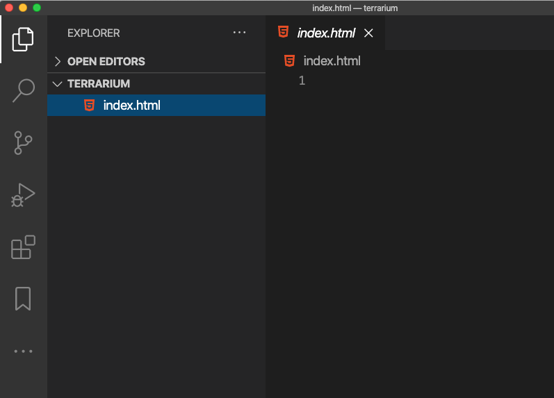

# Projeto terrario Parte 1: Introdução a HTML


> Esboço por [Tomomi Imura](https://twitter.com/girlie_mac)

## Quiz Pré-aula

[Quiz pré-aula](https://happy-mud-02d95f10f.azurestaticapps.net/quiz/15)

### Introdução

HTML, ou Linguagem de Marcação de Hypertexto, é o 'esqueleto' da web. Se CSS 'veste' o seu HTML e JavaScript o dá vida, HTML é o corpo de sua aplicação web. A própria sintaxe HTML reflete isso, ao passo que ela inclui tags "head" (cabeça), "body" (corpo), e "footer" (rodapé).

Nesta lição, usaremos HTML para fazer o layout do 'esqueleto' da interface do nosso terrário virtual. Terá um título e três colunas: uma coluna à direita e outra à esquerda, onde vivem as plantas arrastáveis, e uma área central que será o verdadeiro terrário de aspecto de vidro. Ao final desta lição, você poderá ver as plantas nas colunas, mas a interface parecerá um pouco estranha; não se preocupe, na próxima seção você adicionará estilos CSS à interface para torná-la mais bonita.

### Tarefa

Em seu computador, crie uma pasta chamada 'terrario' e, dentro dela, um arquivo chamado 'index.html'. Você pode fazer isso no Visual Studio Code depois de criar sua pasta terrarium, abrindo uma nova janela do VS Code, clicando em 'abrir pasta' e navegando até sua nova pasta. Clique no pequeno botão 'arquivo' no painel do Explorer e crie o novo arquivo:



Ou

Use esses comando no seu git bash:
* `mkdir terrarium`
* `cd terrarium`
* `touch index.html`
* `code index.html` ou `nano index.html`

> Os arquivos index.html indicam a um navegador que ele é o arquivo padrão em uma pasta; URLs como `https://anysite.com/test` podem ser construídas usando uma estrutura de pasta incluindo uma pasta chamada` test` com `index.html` dentro dela; `index.html` não precisa ser mostrado em uma URL.

---

## O DocType e as tags HTML

A primeira linha de um arquivo HTML é seu DocType. É um pouco surpreendente que você precise ter essa linha bem no topo do arquivo, mas ela diz aos navegadores mais antigos que o navegador precisa renderizar a página em um modo padrão, seguindo a especificação HTML atual.

> Dica: no VS Code, você pode passar o mouse sobre uma tag e obter informações sobre seu uso nos guias de referência do MDN.

A segunda linha deve ser a tag de abertura da tag `<html>`, seguida agora por sua tag de fechamento `</html>`. Essas tags são os elementos-raiz da sua interface.

### Tarefa

Adicione essas linhas ao topo do seu arquivo `index.html`:

```HTML
<!DOCTYPE html>
<html></html>
```

✅ Existem alguns modos diferentes que podem ser determinados definindo o DocType com uma string de consulta:  [Quirks Mode and Standards Mode](https://developer.mozilla.org/docs/Web/HTML/Quirks_Mode_and_Standards_Mode). Esses modos costumavam suportar navegadores muito antigos que não são normalmente usados ​​hoje em dia (Netscape Navigator 4 e Internet Explorer 5). Você pode seguir a declaração doctype padrão.

---

## A 'cabeça' do documento

A área do 'cabeçalho' do documento HTML inclui informações cruciais sobre sua página da web, também conhecidas como [metadados] (https://developer.mozilla.org/docs/Web/HTML/Element/meta). No nosso caso, informamos ao servidor da web para o qual esta página será enviada para ser renderizada, estas quatro coisas:

-   o título da página
-   metadados da página, incluindo:
    - o 'conjunto de caracteres', informando sobre qual codificação de caracteres é usada na página
    - informações do navegador, incluindo `x-ua-compatible`, que indica que o navegador IE = edge é compatível
    - informações sobre como a janela de visualização deve se comportar quando é carregada. Definir a janela de visualização para ter uma escala inicial de 1 controla o nível de zoom quando a página é carregada pela primeira vez.

### Tarefa

Adicione um bloco 'head' ao seu documento entre a tag `<html>` inicial e a final.

```html
<head>
	<title>Bem-vindo ao meu terrário virtual</title>
	<meta charset="utf-8" />
	<meta http-equiv="X-UA-Compatible" content="IE=edge" />
	<meta name="viewport" content="width=device-width, initial-scale=1" />
</head>
```

✅ O que aconteceria se você definir uma metatag de janela de visualização como esta: `<meta name =" viewport "content =" width = 600 ">`? Leia mais sobre a [janela de exibição](https://developer.mozilla.org/docs/Web/HTML/Viewport_meta_tag).

---

## O `corpo` do documento

### Tags HTML

Em HTML, você adiciona tags ao seu arquivo .html para criar elementos de uma página da web. Cada tag geralmente possui uma tag de abertura e de fechamento, como esta: `<p> olá </p>` para indicar um parágrafo. Crie o corpo da sua interface adicionando um conjunto de tags `<body>` dentro do par de tags `<html>`; sua marcação agora se parece com isto:

### Tarefa

```html
<!DOCTYPE html>
<html>
	<head>
		<title>Bem-vindo ao meu terrário virtual</title>
		<meta charset="utf-8" />
		<meta http-equiv="X-UA-Compatible" content="IE=edge" />
		<meta name="viewport" content="width=device-width, initial-scale=1" />
	</head>
	<body></body>
</html>
```

Agora, você pode começar a construir sua página. Normalmente, você usa tags `<div>` para criar os elementos separados em uma página. Vamos criar uma série de elementos `<div>` que conterão imagens.

### Imagens

Uma tag html que não precisa de uma tag de fechamento é a tag ``, porque ela tem um elemento `src` que contém todas as informações que a página precisa para processar o item.

Crie uma pasta em seu aplicativo chamada `images` e nela, adicione todas as imagens da [pasta de código fonte](../solution/images); (são 14 imagens de plantas).

### Tarefa

Adicione essas imagens de plantas em duas colunas entre as tags `<body> </body>`:

```html
<div id="page">
	<div id="left-container" class="container">
		<div class="plant-holder">
			
		</div>
		<div class="plant-holder">
			
		</div>
		<div class="plant-holder">
			
		</div>
		<div class="plant-holder">
			
		</div>
		<div class="plant-holder">
			
		</div>
		<div class="plant-holder">
			
		</div>
		<div class="plant-holder">
			
		</div>
	</div>
	<div id="right-container" class="container">
		<div class="plant-holder">
			
		</div>
		<div class="plant-holder">
			
		</div>
		<div class="plant-holder">
			
		</div>
		<div class="plant-holder">
			
		</div>
		<div class="plant-holder">
			
		</div>
		<div class="plant-holder">
			
		</div>
		<div class="plant-holder">
			
		</div>
	</div>
</div>
```

> Nota: Spans vs. Divs. Divs são considerados elementos de 'bloco' e Spans são 'embutidos'. O que aconteceria se você transformasse esses divs em spans?

Com essa marcação, as plantas agora aparecem na tela. Parece muito ruim, porque eles ainda não foram estilizados usando CSS, e faremos isso na próxima lição.

Cada imagem possui um texto alternativo que aparecerá mesmo se você não puder ver ou renderizar uma imagem. Este é um atributo importante a ser incluído para acessibilidade. Aprenda mais sobre acessibilidade em aulas futuras; por enquanto, lembre-se de que o atributo alt fornece informações alternativas para uma imagem se um usuário por algum motivo não puder visualizá-la (devido à conexão lenta, um erro no atributo src ou se o usuário usar um leitor de tela).

✅ Você notou que cada imagem tem a mesma tag alt? Esta é uma boa prática? Por que ou por que não? Você pode melhorar este código?

---

## Marcação semântica

Em geral, é preferível usar 'semântica' significativa ao escrever HTML. O que isso significa? Isso significa que você usa tags HTML para representar o tipo de dados ou interação para a qual foram projetadas. Por exemplo, o texto do título principal em uma página deve usar uma tag `<h1>`.

Adicione a seguinte linha logo abaixo da tag `<body>` de abertura:

```html
<h1>Meu Terrário</h1>
```

Usar marcação semântica, como ter cabeçalhos `<h1>` e listas não ordenadas renderizadas como `<ul>`, ajuda os leitores de tela a navegar por uma página. Em geral, os botões devem ser escritos como `<button>` e as listas devem ser `<li>`. Embora seja _possível_ usar elementos `<span>` especialmente estilizados com manipuladores de clique para simular botões, é melhor para usuários com deficiência usar tecnologias para determinar onde um botão reside em uma página e para interagir com ele, se o elemento aparecer como um botão. Por esse motivo, tente usar a marcação semântica o máximo possível.

✅ Dê uma olhada em um leitor de tela e [como ele interage com uma página web](https://www.youtube.com/watch?v=OUDV1gqs9GA). Você pode ver por que ter marcação não semântica pode frustrar o usuário?

## O Terrário

A última parte desta interface envolve a criação de marcações que serão estilizadas para criar um terrário.

### Tarefa:

Adicione esta marcação acima da última tag `</div>`:

```html
<div id="terrarium">
	<div class="jar-top"></div>
	<div class="jar-walls">
		<div class="jar-glossy-long"></div>
		<div class="jar-glossy-short"></div>
	</div>
	<div class="dirt"></div>
	<div class="jar-bottom"></div>
</div>
```

✅ Mesmo que você tenha adicionado essa marcação à tela, você não vê absolutamente nada renderizado. Porque?

---

## 🚀Desafio

Existem algumas tags 'mais antigas' selvagens em HTML que ainda são divertidas de brincar, embora você não deva usar tags obsoletas, como [essas tags](https://developer.mozilla.org/docs/Web/HTML/Element#Obsolete_and_deprecated_elements) na sua marcação. Ainda assim, você pode usar a velha tag `<marquee>` para fazer o título h1 rolar horizontalmente? (se o fizer, não se esqueça de removê-lo depois)

## Quiz Pós-aula

[Quiz pós-aula](https://happy-mud-02d95f10f.azurestaticapps.net/quiz/16)

## Revisão e autoestudo

HTML é o sistema de blocos de construção 'testado e comprovado' que ajudou a construir a web no que ela é hoje. Aprenda um pouco sobre sua história estudando algumas tags antigas e novas. Você consegue descobrir por que algumas tags foram descontinuadas e outras adicionadas? Quais tags podem ser introduzidas no futuro?


## Atribuiçao

[Pratique seu HTML: Construa uma maquete de blog](assignment.pt-BR.md)
