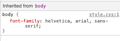
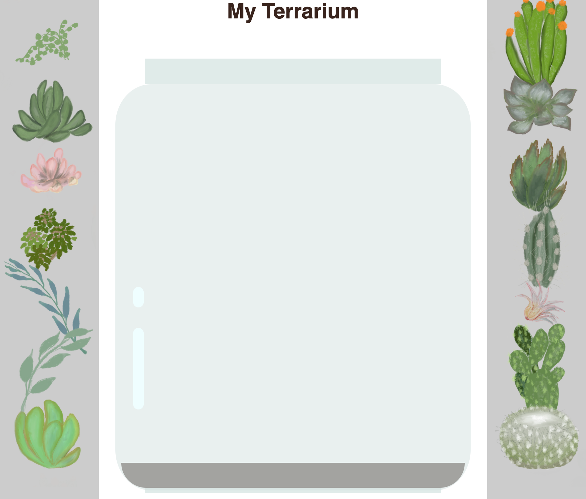

# Projet Terrarium Partie 2 : Introduction à CSS


> Sketchnote par [Tomomi Imura](https://twitter.com/girlie_mac)

## Quiz préalable

[Quiz préalable](https://happy-mud-02d95f10f.azurestaticapps.net/quiz/17?loc=fr)

### Introduction

Les CSS, ou feuilles de style en cascade, résolvent un problème important du développement web : comment rendre votre site web agréable à regarder. Le style de vos applications les rend plus faciles à utiliser et plus belles. Vous pouvez également utiliser les feuilles de style CSS pour créer un design Web réactif (Responsive Web Design, RWD), ce qui permet à vos applications d'être belles quelle que soit la taille de l'écran sur lequel elles sont affichées. CSS n'a pas pour seul but d'améliorer l'apparence de votre application ; ses spécifications incluent des animations et des transformations qui permettent des interactions sophistiquées pour vos applications. Le groupe de travail CSS contribue à la mise à jour des spécifications CSS ; vous pouvez suivre leurs travaux sur le [site du World Wide Web Consortium](https://www.w3.org/Style/CSS/members).

> Remarque : CSS est un langage qui évolue, comme tout ce qui existe sur le Web, et tous les navigateurs ne prennent pas en charge les parties les plus récentes de la spécification. Vérifiez toujours vos implémentations en consultant [CanIUse.com](https://caniuse.com).

Dans cette leçon, nous allons ajouter des styles à notre terrarium en ligne et en apprendre davantage sur plusieurs concepts CSS : la cascade, l'héritage et l'utilisation de sélecteurs, le positionnement et l'utilisation de CSS pour créer des mises en page. Au cours de ce processus, nous allons mettre en page le terrarium et créer le terrarium lui-même.

### Pré-requis

Vous devriez avoir construit le HTML de votre terrarium et être prêt à le styliser.

### Tâches

Dans le dossier de votre terrarium, créez un nouveau fichier appelé `style.css`. Importez ce fichier dans la section `<head>` :

```html
<link rel="stylesheet" href="./style.css" />
```

---

## La Cascade

Les feuilles de style en cascade intègrent l'idée que les styles sont "en cascade", de sorte que l'application d'un style est guidée par sa priorité. Les styles définis par l'auteur du site Web sont prioritaires sur ceux définis par le navigateur. Les styles définis "en ligne" sont prioritaires par rapport à ceux définis dans une feuille de style externe.

### Tâche

Ajoutez le style en ligne "color : red" à votre balise `<h1>` :

```HTML
<h1 style="color: red">Mon Terrarium</h1>
```

Ensuite, ajoutez le code suivant à votre fichier `style.css` :

```CSS
h1 {
 color: blue;
}
```

✅ Quelle couleur s'affiche dans votre application web ? Pourquoi ? Pouvez-vous trouver un moyen de remplacer les styles ? Quand voudriez-vous le faire, ou pourquoi pas ?

---

## Héritage

Les styles sont hérités d'un style ancestral à un style descendant, de sorte que les éléments imbriqués héritent des styles de leurs parents.

### Tâche

Définir la police du corps à une police donnée, et vérifier la police d'un élément imbriqué :

```CSS
body {
	font-family: helvetica, arial, sans-serif;
}
```

Ouvrez la console de votre navigateur dans l'onglet "Éléments" et observez la police de caractères de la page H1. Elle hérite de la police du corps, comme indiqué dans le navigateur :



✅ Peut-on faire en sorte qu'un style imbriqué hérite d'une propriété différente ?

---

## Sélecteurs CSS

### Balises

Jusqu'à présent, votre fichier `style.css` n'a que quelques balises stylisées, et l'application a un aspect assez étrange :

```CSS
body {
	font-family: helvetica, arial, sans-serif;
}

h1 {
	color: #3a241d;
	text-align: center;
}
```

Cette façon de styliser une balise vous permet de contrôler des éléments uniques, mais vous devez contrôler les styles de plusieurs plantes de votre terrarium. Pour ce faire, vous devez utiliser les sélecteurs CSS.

### Identifiants

Ajoutez du style pour mettre en page les conteneurs gauche et droit. Comme il n'y a qu'un seul conteneur gauche et qu'un seul conteneur droit, on leur donne des identifiants dans le balisage. Pour leur donner un style, utilisez `#` :

```CSS
#left-container {
	background-color: #eee;
	width: 15%;
	left: 0px;
	top: 0px;
	position: absolute;
	height: 100%;
	padding: 10px;
}

#right-container {
	background-color: #eee;
	width: 15%;
	right: 0px;
	top: 0px;
	position: absolute;
	height: 100%;
	padding: 10px;
}
```

Ici, vous avez placé ces conteneurs avec un positionnement absolu à l'extrême gauche et droite de l'écran, et vous avez utilisé des pourcentages pour leur largeur afin qu'ils puissent s'adapter aux petits écrans mobiles.

✅ Ce code est assez répété, donc pas "DRY" (Don't Repeat Yourself) ; pouvez-vous trouver une meilleure façon de styliser ces ids, peut-être avec un id et une classe ? Il faudrait modifier le balisage et remanier le CSS :

```html
<div id="left-container" class="container"></div>
```

### Classes

Dans l'exemple ci-dessus, vous avez donné un style à deux éléments uniques de l'écran. Si vous souhaitez que les styles s'appliquent à de nombreux éléments à l'écran, vous pouvez utiliser des classes CSS. Faites-le pour disposer les plantes dans les conteneurs de gauche et de droite.

Remarquez que chaque plante dans le balisage HTML a une combinaison d'identifiants et de classes. Les identifiants sont utilisés par le JavaScript que vous ajouterez plus tard pour manipuler le placement des plantes du terrarium. Les classes, quant à elles, donnent à toutes les plantes un style donné.

```html
<div class="plant-holder">
	
</div>
```

Ajoutez ce qui suit à votre fichier `style.css` :

```CSS
.plant-holder {
	position: relative;
	height: 13%;
	left: -10px;
}

.plant {
	position: absolute;
	max-width: 150%;
	max-height: 150%;
	z-index: 2;
}
```

Ce qui est remarquable dans cet extrait, c'est le mélange de positionnement relatif et absolu, que nous aborderons dans la section suivante. Jetez un coup d'œil à la façon dont les hauteurs sont traitées par les pourcentages :

Vous définissez la hauteur du porte-plante à 13%, un bon chiffre pour garantir que toutes les plantes sont affichées dans chaque conteneur vertical sans qu'il soit nécessaire de les faire défiler.

Vous réglez le porte-plante pour qu'il se déplace vers la gauche afin de permettre aux plantes d'être plus centrées dans leur conteneur. Les images ont une grande quantité d'arrière-plan transparent afin de les rendre plus glissantes, et doivent donc être déplacées vers la gauche pour mieux s'adapter à l'écran.

Ensuite, la plante elle-même se voit attribuer une largeur maximale de 150 %. Cela lui permet de s'adapter à la taille du navigateur. Essayez de redimensionner votre navigateur ; les plantes restent dans leurs conteneurs, mais leur taille est réduite pour s'adapter.

On notera également l'utilisation du z-index, qui permet de contrôler l'altitude relative d'un élément (de sorte que les plantes se trouvent sur le dessus du récipient et semblent se trouver à l'intérieur du terrarium).

✅ Pourquoi faut-il à la fois un support de plantes et un sélecteur CSS de plantes ?

## Positionnement CSS

Le mélange des propriétés de position (il existe des positions statiques, relatives, fixes, absolues et collantes) peut être un peu délicat, mais lorsqu'il est fait correctement, il vous donne un bon contrôle sur les éléments de vos pages.

Les éléments à positionnement absolu sont positionnés par rapport à leurs ancêtres positionnés les plus proches, et s'il n'y en a pas, ils sont positionnés en fonction du corps du document.

Les éléments positionnés de manière relative sont positionnés en fonction des indications du CSS pour ajuster leur placement par rapport à leur position initiale.

Dans notre exemple, le `plant-holder` est un élément à positionnement relatif qui est positionné dans un conteneur à positionnement absolu. Le comportement qui en résulte est que les conteneurs de la barre latérale sont épinglés à gauche et à droite, et que le porte-plante est imbriqué, s'ajustant lui-même dans les barres latérales, ce qui donne de l'espace pour que les plantes soient placées dans une rangée verticale.

> La `plante` elle-même a également un positionnement absolu, nécessaire pour la rendre glissante, comme vous le découvrirez dans la prochaine leçon.

✅ Expérimentez en changeant les types de positionnement des récipients latéraux et du porte-plante. Que se passe-t-il ?

## Dispositions CSS

Vous allez maintenant utiliser ce que vous avez appris pour construire le terrarium lui-même, tout en utilisant le CSS !

Tout d'abord, donnez aux enfants de la div `.terrarium` le style d'un rectangle arrondi à l'aide de CSS :

```CSS
.jar-walls {
	height: 80%;
	width: 60%;
	background: #d1e1df;
	border-radius: 1rem;
	position: absolute;
	bottom: 0.5%;
	left: 20%;
	opacity: 0.5;
	z-index: 1;
}

.jar-top {
	width: 50%;
	height: 5%;
	background: #d1e1df;
	position: absolute;
	bottom: 80.5%;
	left: 25%;
	opacity: 0.7;
	z-index: 1;
}

.jar-bottom {
	width: 50%;
	height: 1%;
	background: #d1e1df;
	position: absolute;
	bottom: 0%;
	left: 25%;
	opacity: 0.7;
}

.dirt {
	width: 60%;
	height: 5%;
	background: #3a241d;
	position: absolute;
	border-radius: 0 0 1rem 1rem;
	bottom: 1%;
	left: 20%;
	opacity: 0.7;
	z-index: -1;
}
```

Notez l'utilisation des pourcentages ici. Si vous réduisez la taille de votre navigateur, vous pouvez voir comment le bocal est également mis à l'échelle. Remarquez également les pourcentages de largeur et de hauteur des éléments du pot et la manière dont chaque élément est positionné de manière absolue au centre, épinglé au bas de la fenêtre.

Nous utilisons également `rem` pour le border-radius, une longueur relative à la police. Pour en savoir plus sur ce type de mesure relative, consultez la [spécification CSS](https://www.w3.org/TR/css-values-3/#font-relative-lengths).

✅ Essayez de modifier les couleurs et l'opacité du bocal par rapport à celles de la saleté. Que se passe-t-il ? Pourquoi ?

---

## 🚀 Défi

Ajoutez un éclat "bulle" à la partie inférieure gauche du pot pour qu'il ressemble davantage à du verre. Vous allez styliser les fichiers `.jar-glossy-long` et `.jar-glossy-short` pour qu'ils ressemblent à une brillance réfléchie. Voici à quoi cela ressemblerait :



Pour répondre au Quiz de validation des connaissances, suivez ce module d'apprentissage : [Donnez du style à votre application HTML avec CSS](https://docs.microsoft.com/learn/modules/build-simple-website/4-css-basics?WT.mc_id=academic-13441-cxa)

## Quiz de validation des connaissances

[Quiz de validation des connaissances](https://happy-mud-02d95f10f.azurestaticapps.net/quiz/18?loc=fr)

## Révision et étude personnelle

Les feuilles de style en cascade (CSS) sont apparemment très simples, mais les difficultés sont nombreuses lorsqu'il s'agit d'adapter parfaitement une application à tous les navigateurs et à toutes les tailles d'écran. CSS-Grid et Flexbox sont des outils qui ont été développés pour rendre le travail un peu plus structuré et plus fiable. Découvrez ces outils en jouant à [Flexbox Froggy](https://flexboxfroggy.com/) et [Grid Garden](https://codepip.com/games/grid-garden/).

## Affectation

[Refactoring CSS](assignment.fr.md)
