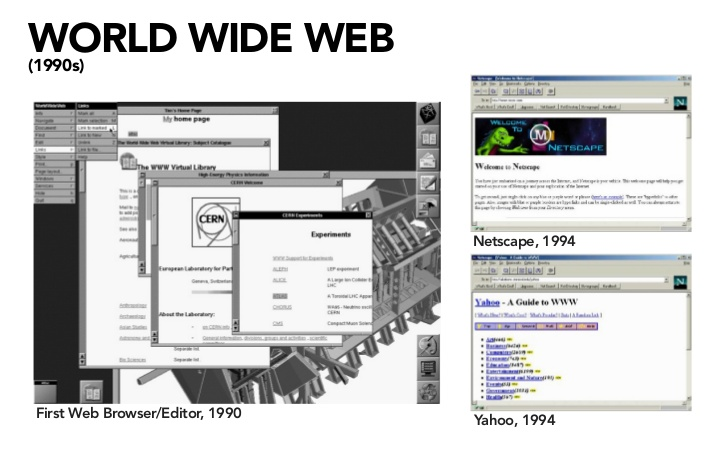
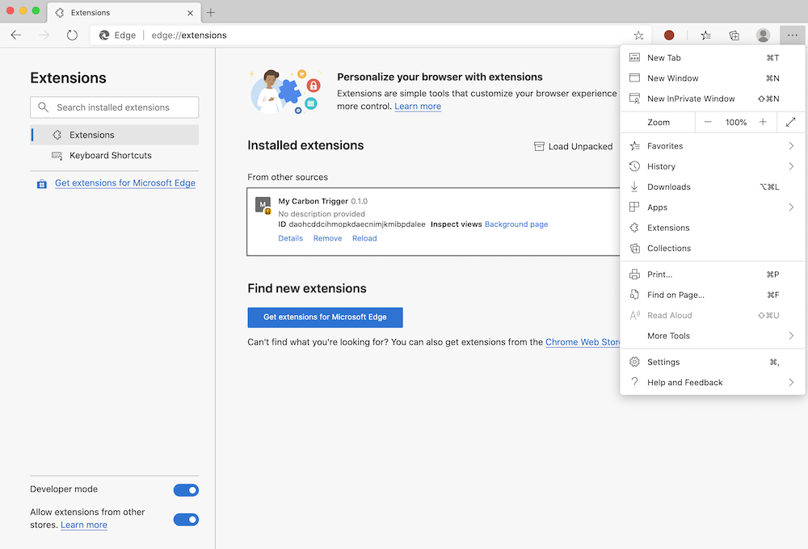
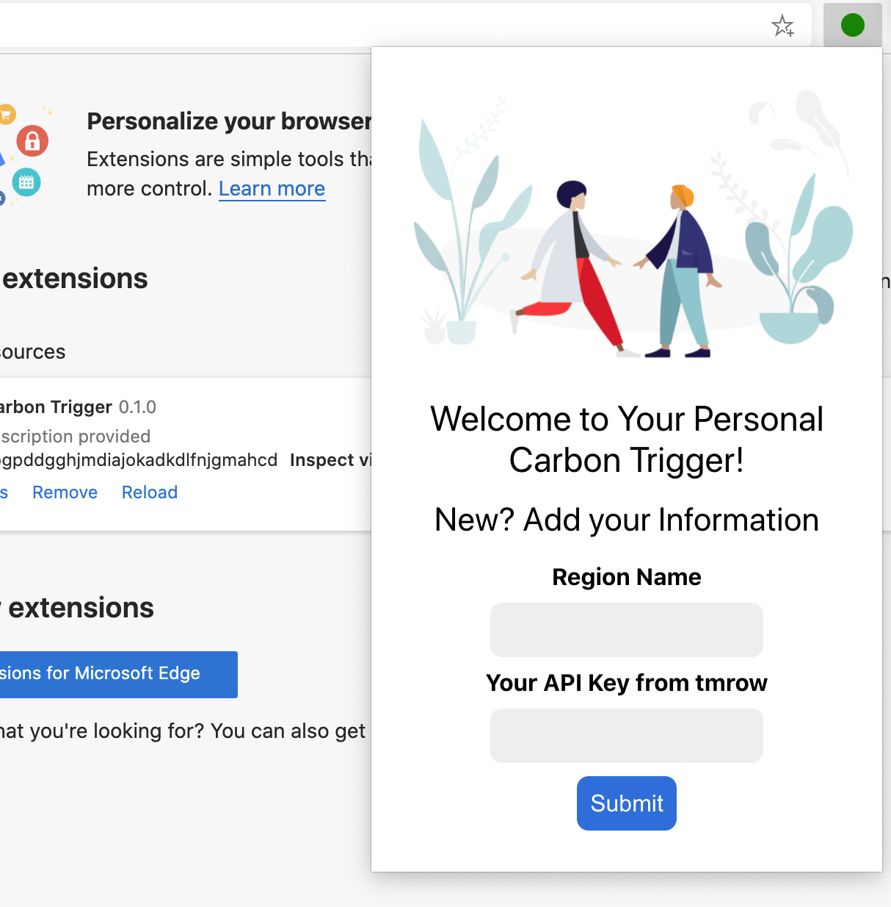
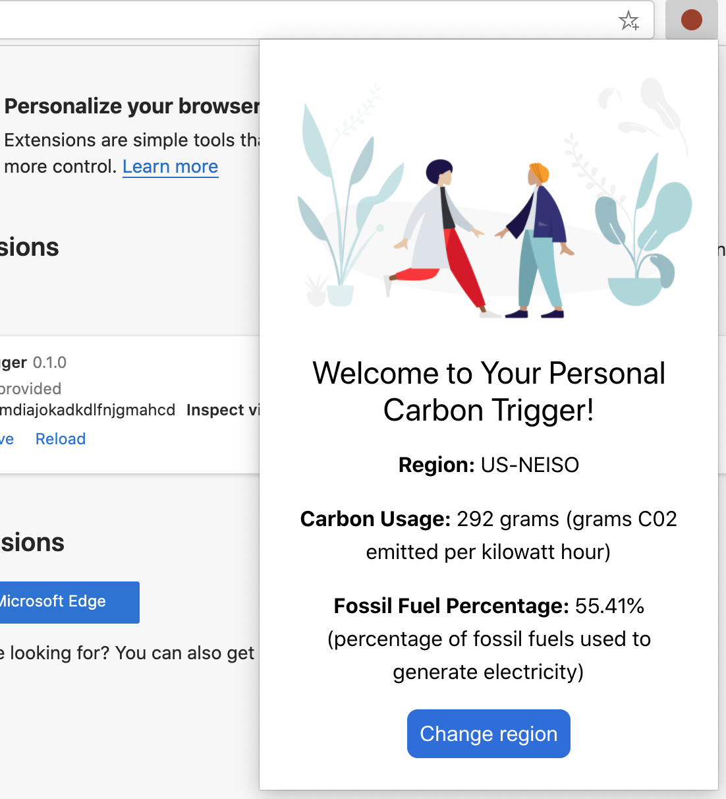

# Projeto de extensão do navegador, parte 1: tudo sobre navegadores


> Esboço de [Wassim Chegham](https://dev.to/wassimchegham/ever-wondered-what-happens-when-you-type-in-a-url-in-an-address-bar-in-a-browser-3dob)

## Leitura pré-quiz
[Leitura pré-quiz](https://happy-mud-02d95f10f.azurestaticapps.net/quiz/23)

### Introdução:

As extensões do navegador adicionam funcionalidade adicional a um navegador. Mas antes de criar um, você deve aprender um pouco sobre como os navegadores funcionam.

### Sobre o navegador:

Nesta série de lições, você aprenderá como construir uma extensão de navegador que funcionará nos navegadores Chrome, Firefox e Edge. Nesta parte, você descobrirá como os navegadores funcionam e estruturará os elementos da extensão do navegador.

Mas o que é exatamente um navegador? É um aplicativo de software que permite ao usuário final acessar o conteúdo de um servidor e exibi-lo em páginas da web.

✅ Um pouco de história: o primeiro navegador chamava-se 'WorldWideWeb' e foi criado por Sir Timothy Berners-Lee em 1990.


> Alguns navegadores antigos, por [Karen McGrane](https://www.slideshare.net/KMcGrane/week-4-ixd-history-personal-computing)

Quando um usuário se conecta à Internet usando um endereço URL (Uniform Resource Locator), geralmente usando o protocolo de transferência de hipertexto por meio de um endereço `http` ou `https`, o navegador se comunica com um servidor da web e busca uma página da web.

Nesse ponto, o mecanismo de renderização do navegador o exibe no dispositivo do usuário, que pode ser um telefone celular, desktop ou laptop.

Os navegadores também têm a capacidade de armazenar o conteúdo em cache para que ele não precise ser recuperado do servidor todas as vezes. Eles podem registrar o histórico da atividade de navegação de um usuário, armazenar 'cookies', que são pequenos bits de dados que contêm informações usadas para armazenar a atividade de um usuário e muito mais.

Uma coisa realmente importante a lembrar sobre os navegadores é que eles não são todos iguais! Cada navegador tem seus pontos fortes e fracos, e um desenvolvedor profissional da web precisa entender como fazer com que as páginas tenham um bom desempenho em navegadores diferentes. Isso inclui lidar com pequenas janelas de visualização, como as de um telefone celular, bem como quando um usuário está offline.

Um site realmente útil que você provavelmente deve adicionar aos favoritos em qualquer navegador de sua preferência é [caniuse.com](https://www.caniuse.com). Quando você está construindo páginas da web, é muito útil usar as listas de tecnologias suportadas do caniuse para que você possa dar o melhor suporte aos seus usuários.

✅ Como você pode saber quais navegadores são mais populares com a base de usuários do seu site? Verifique sua análise - você pode instalar vários pacotes de análise como parte de seu processo de desenvolvimento da web, e eles dirão quais navegadores são mais usados ​​pelos vários navegadores populares.

## Extensões de navegador

Por que você deseja construir uma extensão de navegador? É uma coisa útil para anexar ao seu navegador quando você precisa de acesso rápido às tarefas que tende a repetir. Por exemplo, se você precisar verificar as cores nas várias páginas da web com as quais interage, poderá instalar uma extensão de navegador com seletor de cores. Se você tiver problemas para lembrar as senhas, pode usar uma extensão do navegador para gerenciamento de senhas.

As extensões do navegador também são divertidas de desenvolver. Eles tendem a gerenciar um número finito de tarefas que executam bem.

✅ Quais são as suas extensões de navegador favoritas? Quais tarefas elas realizam?

### Instalando extensões

Antes de começar a construir, dê uma olhada no processo de construção e implantação de uma extensão de navegador. Embora cada navegador varie um pouco na forma como gerenciam essa tarefa, o processo é semelhante no Chrome e no Firefox a este exemplo no Edge:



Basicamente, o processo será:

- construir sua extensão usando `npm build`
- no navegador ir até o painel de extensões usando o ícone `...` na parte superior da direita
- se for uma nova instalação, selecione `load unpacked` para carregar uma nova extensão a partir de sua pasta (no nosso caso, é `/dist`)
- ou clique em `recarregar` se está recarregando a extensão já instalada

✅ Estas instruções referem-se a extensões que você mesmo constrói; para instalar extensões que foram lançadas para seu navegador, você deve navegar até essas [lojas](https://microsoftedge.microsoft.com/addons/Microsoft-Edge-Extensions-Home) e instalar a extensão de sua escolha. 


### Iniciar

Você vai construir uma extensão de navegador que exibe a pegada de carbono da sua região, mostrando o uso de energia da sua região e a fonte da energia. A extensão terá um formulário que coleta uma chave API para que você possa acessar a API do CO2 Signal.

**Você precisa:**

- [uma chave API](https://www.co2signal.com/); coloque seu email no formulário da página e uma chave será enviada para você.
- o [código de sua região](http://api.electricitymap.org/v3/zones) correspondente ao [Mapa de eletricidade](https://www.electricitymap.org/map) (em Boston, por exemplo, EU uso 'US-NEISO').
- o [código de inicio](../../start). Faça o download da pasta `start`; você irá completar o código desta pasta.
- [NPM](https://www.npmjs.com) - NPM é uma ferramenta de gerenciamento de pacotes; instale-o localmente e os pacotes listados em seu arquivo package.json serão instalados para uso por seu app da web.

✅ Saiba mais sobre gerenciamento de pacotes neste [excelente módulo de aprendizagem](https://docs.microsoft.com/learn/modules/create-nodejs-project-dependencies/?WT.mc_id=academic-13441-cxa)

Reserve um minuto para examinar o código base:

dist
     - | manifest.json (padrões definidos aqui)
     - | index.html (marcador HTML do front-end aqui)
     - | background.js (JS de fundo aqui)
     - | main.js (JS construído)
src
     - | index.js (seu código JS vai aqui)

✅ Assim que tiver a chave API e o código da região em mãos, armazene-os em uma nota para uso futuro.

### Construir o HTML para a extensão

Esta extensão possui duas visualizações. Uma para reunir a chave API e o código de região:



E a segunda para mostrar o uso de carbono da região:



Vamos começar construindo o HTML para o formulário e estilizando-o com CSS.

Na pasta `/dist`, você construirá um formulário e uma área de resultados. No arquivo `index.html`, preencha a área delineada do formulário:

```HTML
<form class="form-data" autocomplete="on">
	<div>
		<h2>Novo? Adicione suas informações.</h2>
	</div>
	<div>
	<label for="region">Nome da Região</label>
		<input type="text" id="region" required class="region-name" />
	</div>
	<div>
		<label>Sua chave de API</label>
		<input type="text" required class="api-key" />
	</div>
	<button class="search-btn">Enviar</button>
</form>	
```

Este é o formulário onde suas informações salvas serão inseridas e guardadas no armazenamento local.

Em seguida, crie a área de resultados; após a tag final do formulário, adicione algumas divs:


```HTML
<div class="result">
	<div class="loading">carregando...</div>
	<div class="errors"></div>
	<div class="data"></div>
	<div class="result-container">
		<p><strong>Região: </strong><span class="my-region"></span></p>
		<p><strong>Uso de carbono: </strong><span class="carbon-usage"></span></p>
		<p><strong>Porcentagem de combustível fóssil: </strong><span class="fossil-fuel"></span></p>
	</div>
	<button class="clear-btn">Trocar região</button>
</div>
```
Neste ponto, você pode tentar um build (construção). Certifique-se de instalar o pacote de dependências desta extensão:

```
npm install
```

Este comando usará npm, o Node Package Manager, para instalar o webpack para o processo de build (construção) de sua extensão. Webpack é um bundler (empacotador) que lida com a compilação de código. Você pode ver a saída desse processo olhando em `/dist/main.js` - você vê que o código foi empacotado.

Por enquanto, a extensão deve ser construída (build) e, se você implantá-la (deploy) no Edge como uma extensão, verá um formulário perfeitamente exibido.

Parabéns, você deu os primeiros passos para criar uma extensão de navegador. Nas lições subsequentes, você o tornará mais funcional e útil.

---

## 🚀Desafio 

Dê uma olhada em uma loja de extensões de navegador e instale uma em seu navegador. Você pode examinar seus arquivos de maneiras interessantes. O que você descobriu?

## Quiz pós-leitura
[Quiz pós-leitura](https://happy-mud-02d95f10f.azurestaticapps.net/quiz/24)

## Revisão e auto-estudo

Nesta lição você aprendeu um pouco sobre a história do navegador da web; aproveite esta oportunidade para aprender como os inventores da World Wide Web imaginaram seu uso, lendo mais sobre sua história. Alguns sites úteis incluem:

[A história dos navegadores web](https://www.mozilla.org/firefox/browsers/browser-history/)

[História da Web](https://webfoundation.org/about/vision/history-of-the-web/)

[Uma entrevista com Tim Berners-Lee](https://www.theguardian.com/technology/2019/mar/12/tim-berners-lee-on-30-years-of-the-web-if-we-sueñe-un-poco-podemos-conseguir-la-web-que-queremos)

## Tarefa
[Refatore o estilo de sua extensão](assignment.pt.md)

